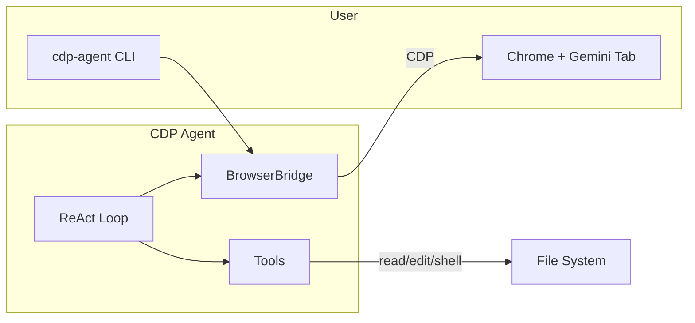

# CDP-Agent

<div align="center">

[](https://github.com/YosefHayim/CDP-Agent/actions)
[](LICENSE)
[](https://github.com/YosefHayim/CDP-Agent/issues)
[](https://bun.sh)

</div>

---

**Autonomous coding agent powered by Gemini via Chrome DevTools Protocol**

CDP-Agent connects to an existing Chrome instance with a Gemini tab open, runs a ReAct loop (THOUGHT → ACTION → OBSERVATION), and executes tools—read_file, search_directory, edit_file, shell—to complete coding tasks autonomously.

---

## What is it

CDP-Agent is an autonomous coding agent that bridges your local codebase with the Gemini web interface using Chrome DevTools Protocol. It runs a ReAct loop (THOUGHT → ACTION → OBSERVATION) — reading files, searching directories, editing code, and running shell commands — without requiring an API key or billing account.

---

## Why

Every production-grade AI coding agent requires API keys, billing setup, and rate limits. CDP-Agent was built to give developers a free, browser-based alternative: connect to an already-open Gemini tab via CDP and use it as the reasoning backend — zero token costs, zero API configuration.

---

## Prerequisites

| Requirement | Details |
|-------------|---------|
| **Bun** | Runtime (v1.x). Install: `curl -fsSL https://bun.sh/install | bash` |
| **Chrome** | Must be launched with `--remote-debugging-port=9222` |
| **Gemini tab** | Open [gemini.google.com](https://gemini.google.com) in Chrome before running |

---

## Quick Start

### Step 1: Clone and install

```bash
git clone https://github.com/YosefHayim/CDP-Agent.git
cd CDP-Agent
bun install
```

### Step 2: Launch Chrome with remote debugging

- **macOS**: `"/Applications/Google Chrome.app/Contents/MacOS/Google Chrome" --remote-debugging-port=9222`
- **Linux**: `google-chrome --remote-debugging-port=9222`
- **Windows**: `"C:\Program Files\Google\Chrome\Application\chrome.exe" --remote-debugging-port=9222`

### Step 3: Open Gemini

Navigate to [gemini.google.com](https://gemini.google.com) in the Chrome window.

### Step 4: Run the agent

```bash
bun run start -- --prompt "Add a README to this project"
```

**Or** use `--launch-chrome` to have the CLI spawn Chrome automatically (no manual setup):

```bash
bun run start -- --launch-chrome --prompt "Add a README to this project"
```

---

## Usage

| Option | Description |
|--------|-------------|
| `--prompt <text>` | Task prompt for the agent (required unless `--resume`) |
| `--resume <id>` | Resume a saved session |
| `--session <id>` | Session name (auto-generated if omitted) |
| `--cdp-port <port>` | Chrome debugging port (default: 9222) |
| `--launch-chrome` | Launch Chrome with remote debugging if not running |
| `--working-dir <path>` | Working directory for file operations |
| `--check-connection` | Test CDP connection and exit |
| `--list-sessions` | List available sessions |
| `--verbose` | Enable debug logging |
| `--config <path>` | Config file path |

### Examples

```bash
# Run a task
bun run start -- --prompt "Fix the lint errors in src/"

# Check connection
bun run start -- --check-connection

# List sessions
bun run start -- --list-sessions

# Resume session
bun run start -- --resume <session-id>
```

---

## Configuration

Optional config file: `.cdp-agent.config.json` (or path via `--config`). See [.cdp-agent.config.json](.cdp-agent.config.json) for the schema.

| Option | Default | Description |
|--------|---------|-------------|
| `cdpPort` | 9222 | Chrome debugging port |
| `maxIterations` | 50 | Max ReAct loop iterations |
| `workingDirectory` | `.` | Working directory for file operations |
| `sessionDir` | `.cdp-agent-sessions` | Session persistence directory |
| `shellTimeout` | 120000 | Shell command timeout (ms) |
| `fileReadMaxSize` | 102400 | Max file size for read (bytes) |

---

## Development

| Command | Description |
|---------|-------------|
| `bun run start` | Run the CLI |
| `bun run dev` | Run with watch mode |
| `bun run build` | Compile standalone binary to `dist/cdp-agent` |
| `bun test` | Run tests |
| `bun run typecheck` | TypeScript check |
| `bun run lint` | Biome lint |
| `bun run check` | typecheck + lint + test |

---

## Project Structure

```
src/
├── cli.ts           # Entry point
├── browser/         # CDP connection, Gemini tab discovery
├── engine/         # ReAct loop, parser, recovery
├── tools/           # read_file, search_directory, edit_file, shell
├── session/         # Session persistence
├── config/          # Config loading
└── prompts/         # System prompt
```

---

## How It Works



---

## Troubleshooting

| Error | Solution |
|-------|----------|
| "Cannot connect to Chrome" | Launch Chrome with `--remote-debugging-port=9222`, or use `--launch-chrome` |
| "No Gemini tab found" | Open gemini.google.com in Chrome before running |
| Session recovery | Use `--list-sessions` then `--resume <id>` |

---

## Contributing

PRs and issues welcome. Fork the repo, create a feature branch, and open a pull request.

---

## Links

- [AGENTS.md](AGENTS.md) – AI agent instructions
- [.ai/](.ai/) – Project documentation
- [progress-project.md](progress-project.md) – Project state
